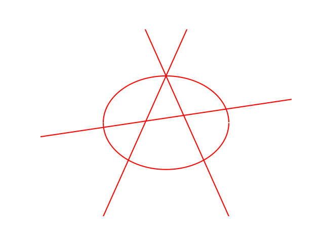

# anarchy-plot
The command line tool for the revolution.


Show the man that you're a revolutionary the old-fashioned way: by drawing the anarchy symbol, before dutifully returning to work.



#### Setup

While simply running the program in `anarchy.py` is all you need to do, we recommend streamlining the revolution by creating a command line interface.
After cloning the repository, navigate to the folder and run the following bash command:
```
$ cp anarchy.py ~/bin/anarchy
```

Now you can spread your revolutionary ideals by simply entering the command `anarchy` in your bash console.

Well done!
I can practically hear the patriarchy crumbling now.
